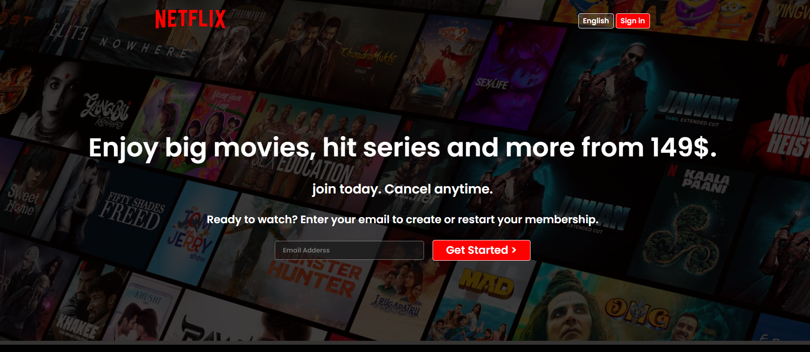

# 🎬 Netflix Landing Page Clone

A fully responsive Netflix-inspired landing page built with **HTML5** and **CSS3**, recreating the clean, modern aesthetic of Netflix's marketing site — including a hero section, email signup form, and mobile-friendly layout.

---

## 🚀 Features

- 📱 **Fully Responsive** — Adapts seamlessly across desktop, tablet, and mobile screens
- 🎨 **Netflix-Inspired UI** — Faithful recreation of Netflix's signature look and feel
- 🧩 **Flexbox Layout** — Clean, maintainable structure using modern CSS layout techniques
- 🌟 **Modern Hero Section** — Eye-catching landing banner with call-to-action
- ✉️ **Email Signup Form** — Functional front-end form for user sign-up

---

## 🛠️ Built With

| Technology | Purpose |
|------------|---------|
| HTML5      | Page structure & semantic markup |
| CSS3       | Styling, layout, and responsiveness |

---

 

## 📷 Preview

<p align="center">
  
</p>
 

 

## 📂 Project Structure

```
project_2_Netflix/
│
├── assets/          # Images, icons, and other static resources
├── index.html       # Main HTML file
├── style.css        # Stylesheet
└── favicon.ico       # Site favicon
```

---

## ⚙️ Getting Started

To run this project locally:

```bash
# Clone the repository
git clone https://github.com/Shaik54/project_2_Netflix.git

# Navigate into the project directory
cd project_2_Netflix

# Open index.html in your browser
```

No build tools or dependencies required — just open `index.html` directly in your browser.

---

## 📚 What I Practiced

- Semantic HTML5
- CSS Flexbox
- Responsive Web Design
- Media Queries
- Positioning
- Layout Design

## 👨‍💻 Author

**Shaik Moin**

- 🔗 GitHub: [@Shaik54](https://github.com/Shaik54)
- 💼 LinkedIn: [Shaik Moin](https://www.linkedin.com/in/shaik-moin-74b390320/)

---

 
## 📄 License

This project is open source and available for learning purposes. Feel free to fork and customize it.

---

<p align="center">⭐ If you like this project, consider giving it a star on GitHub!</p>
